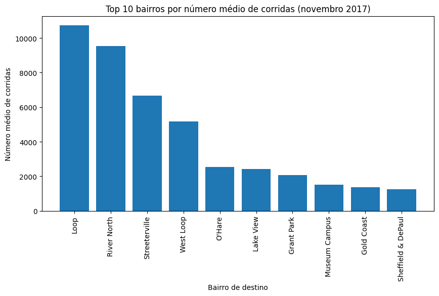
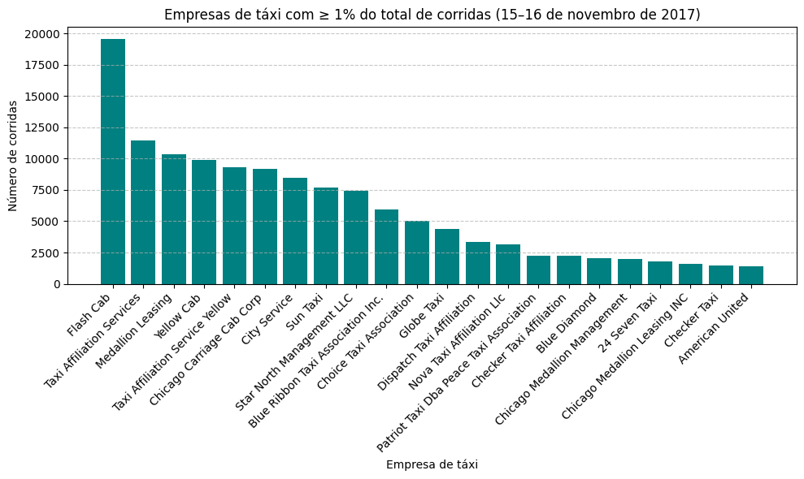

# Lançamento Zuber em Chicago: Análise de Mercado e Impacto Externo
Este projeto consiste em uma análise estratégica de dados para o lançamento do aplicativo Zuber, uma nova empresa de ride-sharing em Chicago. 
O objetivo é identificar padrões de consumo, analisar a concorrência e validar cientificamente o impacto de fatores externos, como o clima, na operação de transporte urbano.

### Tecnologias e Ferramentas:
- Extração de Dados: Web Scraping (Python) para coleta de dados meteorológicos.
- Banco de Dados: SQL para limpeza, filtragem e integração de dados (JOINs, CASE, Agrupamentos).
- Análise de Dados: Python e biblioteca Pandas.
- Visualização de Dados: Matplotlib e Seaborn.
- Estatística: Teste de Hipóteses com a biblioteca SciPy.

### Descrição do Projeto:
Como analista de dados da Zuber, trabalhei com um banco de dados contendo informações sobre bairros (neighborhoods), frotas de táxi (cabs), registros de corridas (trips) 
e dados meteorológicos (weather_records).

### Etapas de Desenvolvimento:
- Web Scraping: Extração e análise de dados climáticos de Chicago em Novembro de 2017.
- Processamento SQL: * Análise de market share entre empresas líderes (como Flash Cab e Taxi Affiliation Services).
- Integração de dados de viagens com condições climáticas através de chaves temporais.
- Segmentação de condições climáticas em "Good" (Bom) e "Bad" (Ruim) usando lógica condicional SQL.
- Análise Exploratória em Python: Estudo dos 10 principais destinos e volume de corridas por empresa.
- Teste de Hipótese Estatística: Avaliação da variação da duração das viagens sob diferentes condições climáticas.

### Visualização de Insights
#### Destinos mais populares em Chicago

#### Volume de Corridas por Empresa com mais de 1% de Mercado (Market Share)

# Teste de Hipótese:
Pergunta: A duração média das viagens do bairro Loop para o Aeroporto Internacional O'Hare muda nos sábados chuvosos?
Hipótese Nula (H0): A duração média das viagens é igual em sábados chuvosos e não chuvosos.
Hipótese Alternativa (H1): A duração média das viagens difere significativamente em sábados chuvosos.

Metodologia: Foi utilizado um Teste t de Student para amostras independentes com um nível de significância (α) de 5%.

# Conclusões Principais:
- Domínio de Mercado: As empresas Flash Cab e Taxi Affiliation Services dominam o mercado de Chicago, sugerindo que a Zuber deve focar em diferenciais competitivos 
ou nichos de bairros específicos.
- Destinos Estratégicos: O bairro Loop e o Aeroporto O'Hare são os destinos mais frequentes, representando zonas críticas para o posicionamento da frota.
- Impacto Logístico do Clima: (Ajuste aqui conforme seu resultado final): O teste estatístico confirmou que o tempo de viagem aumenta significativamente em dias de chuva, indicando a necessidade de modelos de precificação dinâmica e alertas de tempo de espera para melhorar a experiência do usuário.

# Como visualizar o projeto
Os resultados das consultas SQL podem ser encontrados nos 3 arquivos .csv no repositório.
A análise completa e os testes estatísticos estão detalhados no arquivo analise_mobilidade_urbana.ipynb.

